<p align="center">
  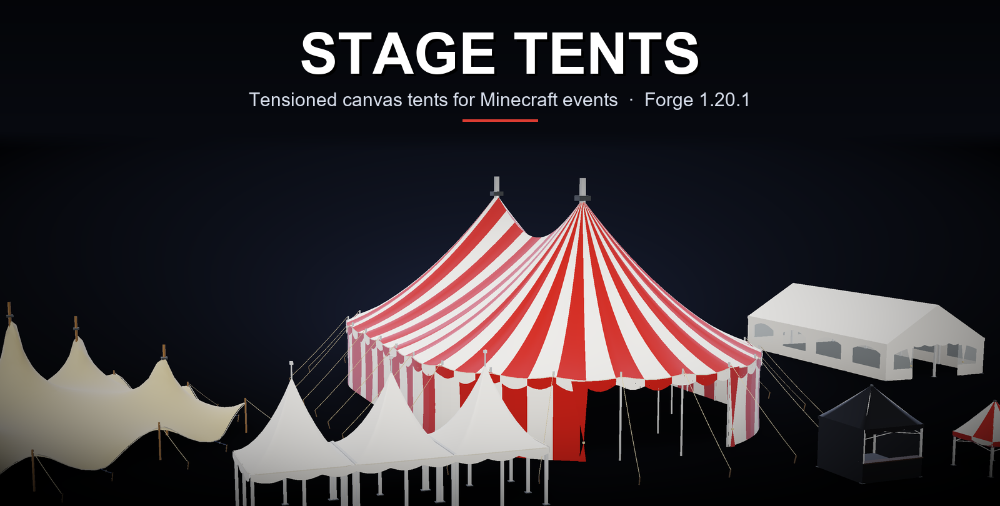
</p>

<p align="center">
  
  
  
  
  
  <a href="https://github.com/naileclevrai/stage-tent-mod/actions/workflows/build.yml"></a>
</p>

<p align="center">
  <b>Real tensioned canvas tents for building stages, festivals and events in Minecraft.</b><br>
  Place a plate, open the settings, and get a big top, a pagoda village or a reception tent: no block-by-block building.
</p>

---

## Why Stage Tents?

Block-built tents always look like boxes. Stage Tents draws the canvas as a real surface:
- it sags between the masts, is pulled down to the eave and scallops between the poles;
- you can still walk inside, stay out of the rain and build on stages.

The tents are rendered meshes. Thin invisible collision cells follow the canvas, so walls stop you within a few centimetres of the fabric and guy ropes never block you.

## Tents

<table>
  <tr>
    <td width="50%">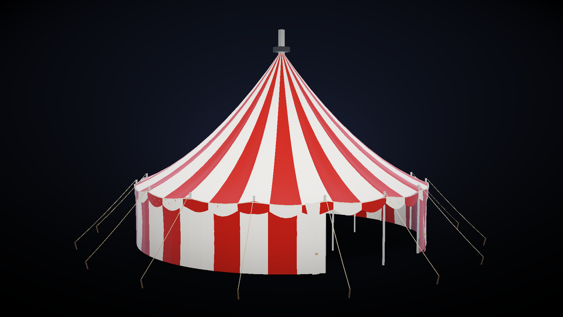<br><b>Big top</b>: circus top with king poles, quarter poles, scalloped valance, guy ropes and pennants. Round or long, with 1 to 8 masts.</td>
    <td width="50%">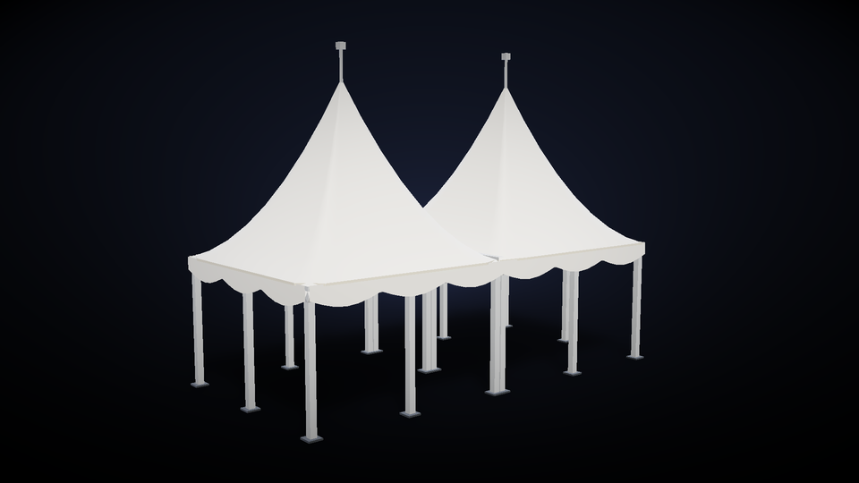<br><b>Pagoda</b>: deeply curved peak on aluminium legs. Square or stretched, joinable side by side with gutters.</td>
  </tr>
  <tr>
    <td>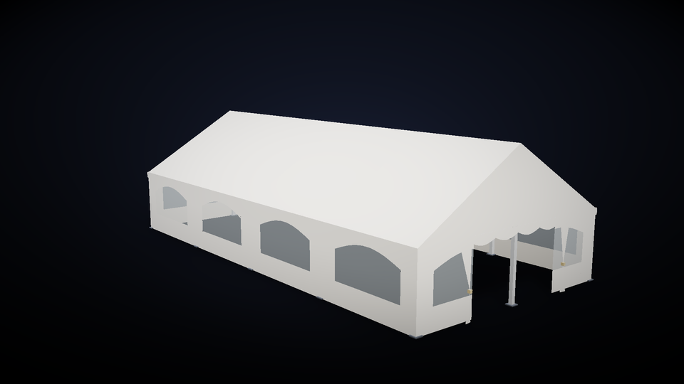<br><b>Reception tent</b>: two-pitch frame tent in bays, with rafters, gable posts and arched windows. Up to 30 × 64.</td>
    <td>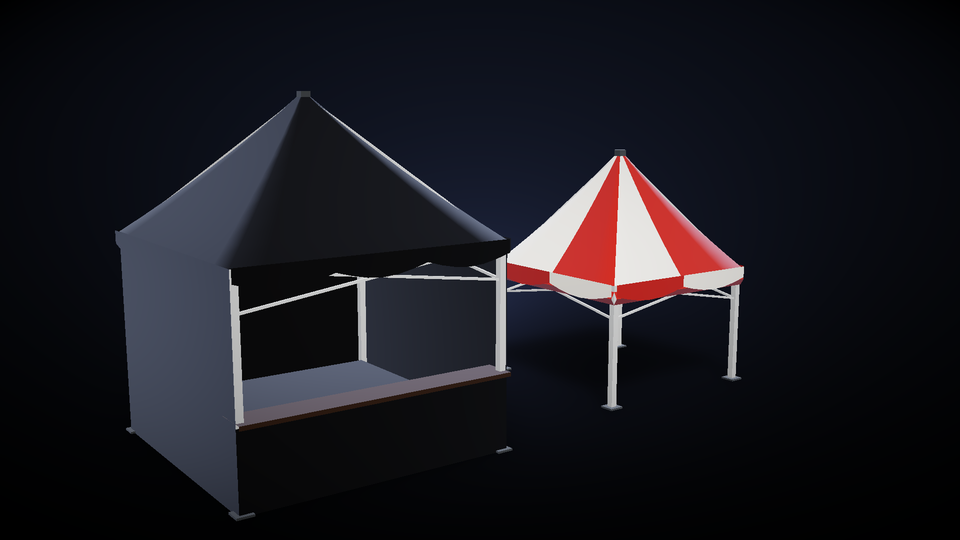<br><b>Folding gazebo</b>: scissor-frame canopy for bars and stalls. Shown here with the <i>FOH control</i> preset (black, counter front).</td>
  </tr>
  <tr>
    <td>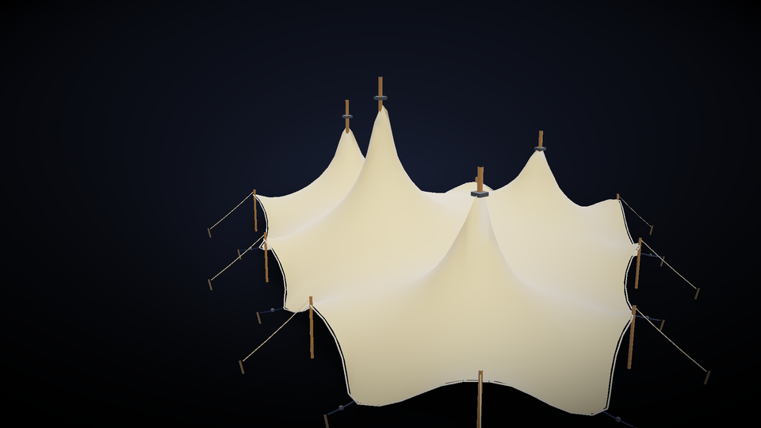<br><b>Stretch tent</b>: one membrane over the poles you place yourself, solved as tensioned fabric, with edge poles and ratchet straps.</td>
    <td>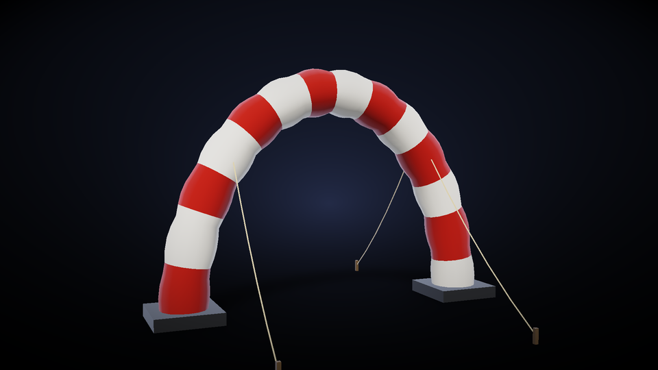<br><b>Inflatable arch</b>: puffed chambers in two colours, ballast feet and guy ropes. Start lines and entrances.</td>
  </tr>
  <tr>
    <td colspan="2">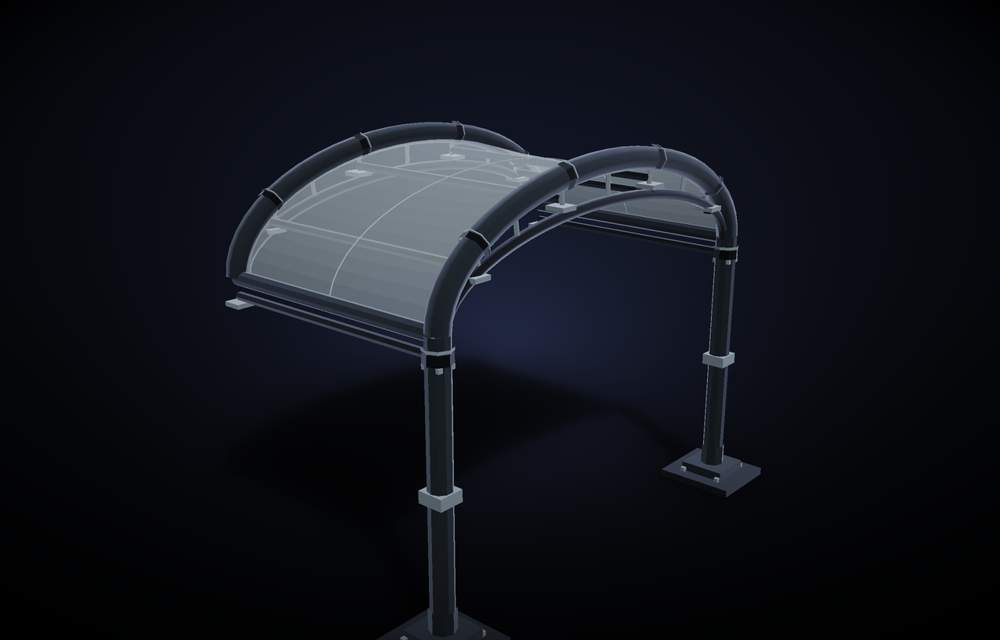<br><b>DJ PVC canopy</b>: a clear sheet on both sides of one curved tube, held by two upright poles and open underneath. Set the span, depth and height in the plate menu; choose a frame finish and canopy tint.</td>
  </tr>
</table>

## Inside

<table>
  <tr>
    <td width="50%">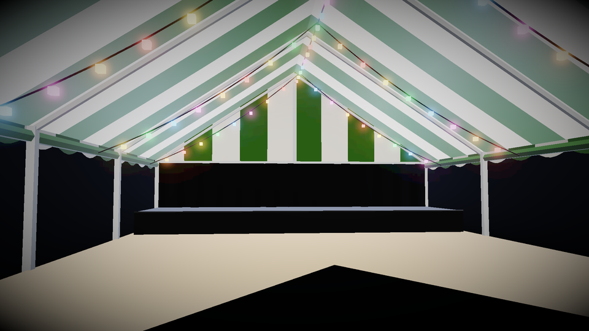<br>Wooden floor, stage with a pleated back drape, party festoons, aluminium structure.</td>
    <td width="50%">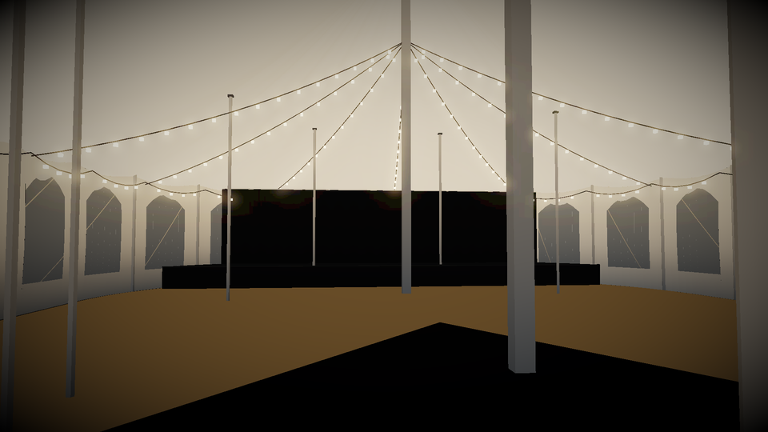<br>Warm festoons give real light inside the tent.</td>
  </tr>
</table>

## Features

| | |
|---|---|
| **Canvas** | Two colours with stripes, any RGB colour (palette or hex), separate lining colour, valance, bolt rope, tied-back door curtains |
| **Walls** | Closed, rolled up, or with arched windows. Entrances: front, both ends, open front, or counter (table-height front with a shelf) |
| **Fittings** | Floors (light/dark wood, red/black carpet, dance floor) up to 1 block high, stage with height, depth and back drape |
| **Lights** | Warm or multicolour festoons that place real light sources |
| **Rigging** | Bars under the ridge, around the masts or under the eave. They become **Theatrical** pipes when Theatrical is installed, so fixtures hang from them |
| **DJ roof** | Clear PVC sheet on both sides of one curved tube, on two poles. Adjustable span, depth and height; optional rigging lamps |
| **Modular** | Pagodas, reception tents and gazebos join side by side: shared sides lose their walls and get a gutter. Joins can be detected automatically |
| **Weather** | The canvas, valance, curtains and flags ripple gently, more in the rain and a lot in a storm |
| **Furniture** | Round banquet tables, standing tables, banquet chairs, bar counters and bleachers. Dyeable, and the seats can be sat on |
| **Tools** | Rigging wrench to copy and paste settings or open the tent you stand in; `/stagetents clean` repairs collision cells |
| **Presets** | Classic circus, concert black, wedding, cabaret, guinguette, reception, garden party, FOH control and more |

## Getting started

1. Install [Minecraft Forge](https://files.minecraftforge.net/net/minecraftforge/forge/index_1.20.1.html) **1.20.1** (47.2 or newer).
2. Download the jar from the [Actions artifacts](https://github.com/naileclevrai/stage-tent-mod/actions) or the releases, and drop it in your `mods` folder.
3. In game, open the **Stage Tents** creative tab and place a tent plate. The entrance faces you.
4. **Right-click the plate** to open the settings. Every change previews live; **Done** applies it.

<p align="center">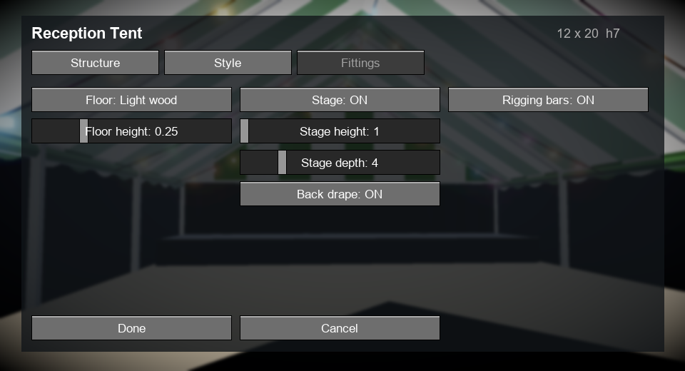</p>

The settings are split into three tabs:
- **Structure**: dimensions, walls, entrances, joined sides, stretch poles.
- **Style**: colours, lining, stripes, valance, lights, ropes, flags, presets, plate visibility.
- **Fittings**: floor, stage, drape, rigging bars.

### Rigging wrench

| Action | Effect |
|---|---|
| Use on a tent plate | Paste copied settings, or open the settings |
| Sneak + use on a tent plate | Copy its settings |
| Use in the air inside a tent | Open that tent's settings |
| Sneak + use in the air | Forget the copied settings |

### Stretch tents

Place **stretch tent poles** around the plate, within 24 blocks. Right-click a pole to raise it, and sneak + right-click to lower it. The tent picks the poles up and re-solves its membrane automatically.

### Commands

`/stagetents clean [radius]` (op): removes orphaned invisible tent cells and rebuilds the tents around you.

## Screenshots

<table>
  <tr>
    <td width="50%">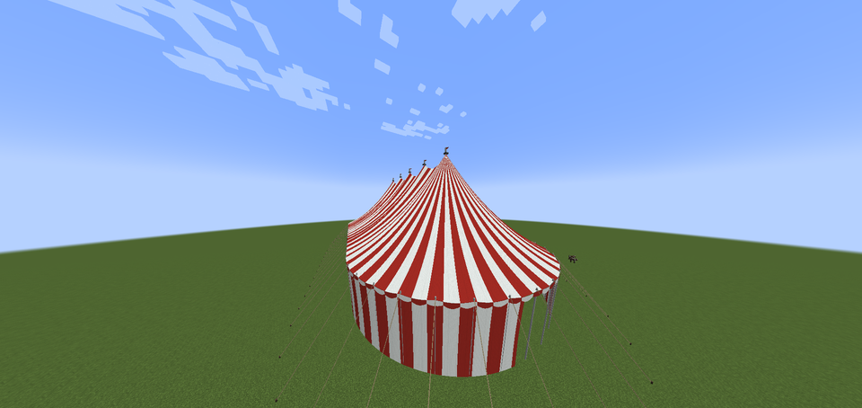</td>
    <td width="50%">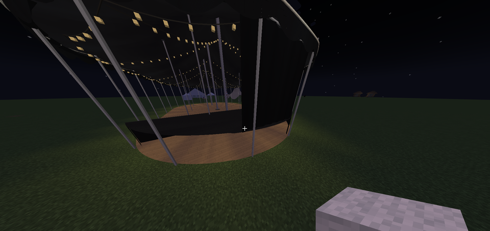</td>
  </tr>
</table>

## Performance

Tents are baked into meshes once per settings change and streamed with a single bulk call per vertex. The renderer then:
- skips the outside of the canvas when the camera is inside;
- skips the inside of the canvas and the thin details when far away;
- stops the wind animation past 40 blocks;
- spreads light refreshes over several frames.

Measured with `./gradlew benchMeshes` (CPU time to stream one tent per frame):

| Tent | Quads | Near | Inside | Far |
|---|---:|---:|---:|---:|
| Big top 20 (default) | 3.9k | 0.6 ms | 0.1 ms | 0.1 ms |
| Big top 40 × 80, lights + windows | 29.8k | 1.4 ms | 0.9 ms | 0.3 ms |
| Big top 64 × 128 (worst case) | 53.8k | 2.4 ms | 1.6 ms | 0.4 ms |
| Reception 20 × 40, lights | 8.5k | 0.4 ms | 0.3 ms | 0.1 ms |

## Building from source

```bash
./gradlew build          # jar in build/libs
./gradlew runClient      # dev client
./gradlew benchMeshes    # mesh performance bench
./gradlew dumpMeshes     # dump tent meshes for offline previews
```

Requires JDK 17. The project uses ForgeGradle 6 with official mappings.

## Roadmap

- Banners and logos printed on the canvas
- Theatrical truss rings inside big tops
- More furniture (stage risers, crowd barriers, FOH desks)

## License

Stage Tents is released under the [Mozilla Public License 2.0](LICENSE).

---

### 🇫🇷 En bref

Stage Tents ajoute de **vraies tentes en toile tendue** pour construire des scènes et des événements : chapiteau de cirque, pagode, tente de réception, barnum pliant, tente stretch, arche gonflable et toile DJ en PVC. On pose une platine, on règle tout dans le menu (dimensions, couleurs, murs, fenêtres, plancher, scène, guirlandes, barres d'accroche compatibles Theatrical), et la tente apparaît, avec des collisions fines qui suivent la toile. Du mobilier d'événement est aussi fourni : tables, mange-debout, chaises, bar et gradins.
